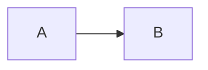

# Zensical

Zensical is a static site generator built by the Material for MkDocs team as
the successor to MkDocs. It is written in Rust, ships a `zensical` CLI, and
renders templates with MiniJinja (a Rust Jinja implementation) rather than
Python Jinja.

**The core rule for this skill: Zensical *is* MkDocs, but always write
Zensical syntax.** The feature surface, HTML structure, URL structure, and
Markdown are all inherited from Material for MkDocs, so knowledge of Material
transfers almost completely. What does **not** transfer is the configuration
file: use `zensical.toml` (TOML, everything under a `[project]` scope), never
`mkdocs.yml` (YAML, flat top-level keys). Zensical can still read `mkdocs.yml`
as a transition mechanism, but new work goes in `zensical.toml`.

Never run `mkdocs build`, `mkdocs serve`, or `mkdocs new`. Never install or
recommend `mkdocs` or `mkdocs-material` as the build tool for a Zensical
project.

## Translation table (MkDocs → Zensical)

| MkDocs / Material | Zensical |
|---|---|
| `mkdocs.yml` | `zensical.toml` |
| `mkdocs serve` | `zensical serve` |
| `mkdocs build` | `zensical build` |
| `mkdocs new` | `zensical new` |
| `mkdocs gh-deploy` | no equivalent — build, then deploy `site_dir` yourself |
| top-level YAML keys | everything nested under `[project]` |
| `theme:` block | `[project.theme]` |
| `theme.palette:` list | `[[project.theme.palette]]` (array of tables) |
| `markdown_extensions:` list | `[project.markdown_extensions]` table |
| `plugins:` list | `[project.plugins.<name>]` table |
| `!!python/name:...` YAML tags | plain quoted strings |
| `pip install mkdocs-material` | `uv add zensical` |

Anything not in this table (feature flag names, front matter keys, Markdown
syntax, CSS classes, template block names) is unchanged from Material.

## CLI

```bash
zensical COMMAND [OPTIONS] [ARGS]...
```

Three commands only: `new`, `serve`, `build`.

```bash
# Scaffold a project (writes zensical.toml with commented defaults)
zensical new

# Preview with live reload — preview server only, never for production
zensical serve
zensical serve -o                      # open in default browser
zensical serve -a localhost:3000       # override dev_addr
zensical serve -f path/to/zensical.toml

# Build the static site into site_dir
zensical build
zensical build -c                      # --clean, clears the build cache
zensical build -s                      # --strict, fails on validation warnings
```

Help: `zensical --help`, `zensical <command> --help`.

When a build behaves strangely — especially right after a version upgrade —
`--clean` first before investigating anything else. Stale cache is the most
common cause of inexplicable output.

Under uv: `uv add zensical`, then `uv run zensical serve`.

## zensical.toml

Everything lives under a `[project]` scope. Additional scopes are planned;
for now, if a setting isn't under `[project]`, it's wrong.

### Core settings

```toml
[project]
site_name = "My Project"                      # REQUIRED
site_url = "https://example.com/myproject/"   # required for instant nav/previews
site_description = "Documentation for My Project"
site_author = "Jane Doe"
copyright = "Copyright &copy; 2026 Jane Doe"  # plain text or an HTML fragment
docs_dir = "docs"                             # relative to this file
site_dir = "site"                             # relative to this file
repo_url = "https://github.com/me/myproject"
edit_uri = "edit/main/docs"
use_directory_urls = true                     # default
dev_addr = "localhost:8000"                   # default
watch = ["data.csv", "fragments"]             # extra paths triggering full rebuild
```

Gotchas that cause real failures:

- **`docs_dir` cannot be `.`** — a current limitation. Use a subdirectory.
- **`site_url` is mandatory for `navigation.instant` and instant previews**,
  because both rely on the generated `sitemap.xml`, which is empty without it.
- `use_directory_urls = false` is set automatically when building for offline
  usage. With `true`, `usage.md` → `/usage/`; with `false`, → `/usage.html`.
- Already watched without configuration: everything in `docs_dir`, theme
  files, Snippets `base_path`/`auto_append`, Macros module/include paths, and
  mkdocstrings `paths`. Only add `watch` entries beyond those.

### Unsupported mkdocs.yml settings

These are silently ignored — do not carry them over from a migration, and
flag them if they appear in an existing config:

`remote_branch`, `remote_name`, `exclude_docs`, `draft_docs`, `not_in_nav`,
`hooks`

`hooks` in particular has no Zensical equivalent; a project relying on MkDocs
build hooks needs those reimplemented before migrating.

### Navigation

Omit `nav` entirely and Zensical derives structure from the `docs_dir`
directory layout. To be explicit, `nav` is a TOML array where each entry is
either a bare path string or a single-key inline table mapping title → target.
Paths are relative to `docs_dir`.

```toml
[project]
nav = [
  "index.md",                                  # title inferred from content
  { "Home" = "index.md" },                     # explicit title
  { "About" = [                                # section
    "about/index.md",                          # section index page
    { "Vision" = "about/vision.md" },
  ] },
  { "GitHub" = "https://github.com/me/repo" }, # unresolvable path = external URL
]
```

Sections nest arbitrarily. Any string that can't resolve to a Markdown page is
treated as an external URL — which means a typo'd path silently becomes a
broken external link rather than erroring. Use `--strict` to catch these.

`index.md` (or `README.md`) as the first entry in a section becomes that
section's index page when `navigation.indexes` is enabled.

### Theme

```toml
[project.theme]
variant = "modern"          # "modern" (default) or "classic"
custom_dir = "overrides"    # relative to the config file
favicon = "images/favicon.ico"
logo = "images/logo.svg"
language = "en"
features = [ ... ]
```

`modern` is the default and is a fresh design; `classic` matches Material for
MkDocs exactly. **Pick `classic` when porting a site whose CSS/JS
customizations were tuned against Material** — the HTML structure is identical
in both variants, so customizations usually survive either way, but `classic`
is the safe target when they don't.

### Theme features

Feature flags are unchanged from Material. Full set:

```toml
[project.theme]
features = [
  "announce.dismiss",
  "content.action.edit",              # needs repo_url
  "content.action.view",              # needs repo_url
  "content.code.annotate",
  "content.code.copy",
  "content.code.select",
  "content.footnote.tooltips",
  "content.tabs.link",
  "content.tooltips",
  "header.autohide",
  "navigation.expand",
  "navigation.footer",
  "navigation.indexes",
  "navigation.instant",               # needs site_url
  "navigation.instant.prefetch",      # needs navigation.instant
  "navigation.instant.progress",      # needs navigation.instant
  "navigation.path",                  # breadcrumbs
  "navigation.prune",
  "navigation.sections",
  "navigation.tabs",
  "navigation.tabs.sticky",           # needs navigation.tabs
  "navigation.top",
  "navigation.tracking",
  "search.highlight",
  "search.share",
  "search.suggest",
  "toc.follow",
  "toc.integrate",
]
```

**Mutually exclusive pairs — setting both is a config bug:**

- `navigation.prune` × `navigation.expand` — expansion needs the full
  navigation tree, pruning removes it.
- `navigation.indexes` × `toc.integrate` — sections can't host a table of
  contents, no room.

`navigation.tabs` and `navigation.sections` *can* combine: with both, sections
render for level-2 navigation items. Tabs and sections only apply above a
1220px viewport; below that they fall back to normal navigation.

`navigation.prune` cuts built-site size by 33%+ on large sites by omitting
non-visible navigation from each page's HTML — worth enabling on anything with
thousands of pages.

### Color palette

`palette` is an **array of tables** (`[[project.theme.palette]]`) when
offering a toggle, or a single table when fixed.

```toml
# Single fixed palette
[project.theme.palette]
scheme = "default"          # "default" = light, "slate" = dark
primary = "indigo"
accent = "indigo"
```

```toml
# Toggle: automatic → light → dark
[[project.theme.palette]]
media = "(prefers-color-scheme)"
toggle.icon = "lucide/sun-moon"
toggle.name = "Switch to light mode"

[[project.theme.palette]]
media = "(prefers-color-scheme: light)"
scheme = "default"
primary = "deep purple"
accent = "purple"
toggle.icon = "lucide/sun"
toggle.name = "Switch to dark mode"

[[project.theme.palette]]
media = "(prefers-color-scheme: dark)"
scheme = "slate"
primary = "deep purple"
accent = "pink"
toggle.icon = "lucide/moon"
toggle.name = "Switch to system preference"
```

Media queries are evaluated in definition order; the first match wins on
first visit. `primary` and `accent` can differ per palette entry.

`toggle.icon` **must** resolve to a bundled icon path or the build fails.
`toggle.name` becomes the `title` attribute — always set it, it's the
accessible name.

Valid `primary`: `red`, `pink`, `purple`, `deep purple`, `indigo`, `blue`,
`light blue`, `cyan`, `teal`, `green`, `light green`, `lime`, `yellow`,
`amber`, `orange`, `deep orange`, `brown`, `grey`, `blue grey`, `black`,
`white`, `custom`.

Valid `accent`: same list minus `brown`, `grey`, `blue grey`, `black`,
`white`.

### Icons

```toml
[project.theme.icon]
logo = "material/library"
repo = "fontawesome/brands/github"

[project.theme.icon.admonition]
note = "octicons/tag-16"
tip = "octicons/squirrel-16"
warning = "octicons/alert-16"
# ... any admonition type
```

Icon sets: `material/*`, `fontawesome/{brands,regular,solid}/*`,
`octicons/*`, `simple/*`, `lucide/*`.

### Extra / social

```toml
[project.extra]
key = "value"                # arbitrary values, readable from templates

[[project.extra.social]]
icon = "fontawesome/brands/github"
link = "https://github.com/me/repo"
name = "GitHub"

[[project.extra.social]]
icon = "fontawesome/brands/python"
link = "https://pypi.org/project/mypackage/"
```

### Additional CSS and JavaScript

Paths are relative to `docs_dir`.

```toml
[project]
extra_css = ["stylesheets/extra.css"]
extra_javascript = [
  "javascripts/extra.js",
  { path = "javascripts/module.js", type = "module" },
  { path = "javascripts/async.js", async = true },
  { path = "javascripts/deferred.js", defer = true },
]
```

Entries are either a plain string or an inline table with `path` plus
`type` / `async` / `defer`.

**Auto-detection caveat:** Zensical infers `type="module"` from an `.mjs`
extension **only when the entry is a plain string**. The moment you use the
inline-table form to set `async`, you must also set `type` explicitly, or the
module-ness is lost.

**JavaScript must hook `document$`, not `DOMContentLoaded`:**

```javascript
document$.subscribe(function() {
  // Initialize third-party libraries here
})
```

With `navigation.instant`, page transitions never reload the browser, so
`DOMContentLoaded` fires exactly once for the whole session and any
initialization bound to it silently stops working after the first navigation.
`document$` is an observable that emits on every page change.

## Markdown extensions

Configured as a **table with dotted keys**, not a YAML list. An extension with
no options gets `= {}`.

```toml
[project.markdown_extensions]
abbr = {}
admonition = {}
attr_list = {}
def_list = {}
footnotes = {}
md_in_html = {}
tables = {}
toc.permalink = true
toc.title = "On this page"
pymdownx.arithmatex.generic = true
pymdownx.betterem = {}
pymdownx.caret = {}
pymdownx.details = {}
pymdownx.emoji.emoji_generator = "zensical.extensions.emoji.to_svg"
pymdownx.emoji.emoji_index = "zensical.extensions.emoji.twemoji"
pymdownx.highlight.anchor_linenums = true
pymdownx.highlight.line_spans = "__span"
pymdownx.highlight.pygments_lang_class = true
pymdownx.inlinehilite = {}
pymdownx.keys = {}
pymdownx.magiclink = {}
pymdownx.mark = {}
pymdownx.smartsymbols = {}
pymdownx.snippets.base_path = ["docs", "docs/snippets"]
pymdownx.superfences.custom_fences = [
  { name = "mermaid", class = "mermaid", format = "pymdownx.superfences.fence_code_format" },
]
pymdownx.tabbed.alternate_style = true
pymdownx.tabbed.combine_header_slug = true
pymdownx.tasklist.custom_checkbox = true
pymdownx.tilde = {}
```

The block above is the default set written by `zensical new`. Two important
consequences:

- **If the config declares no extensions at all, Zensical applies these
  defaults.** The moment you declare `[project.markdown_extensions]` with even
  one entry, you are specifying the complete set — anything omitted is off.
  Declaring only `pymdownx.details` silently disables admonitions, tables,
  emoji, and everything else.
- **This default set differs from MkDocs', which enables only `meta`, `toc`,
  `tables`, and `fenced_code`.** A project that built fine under MkDocs may
  behave differently here; if a migration produces strange output, turning the
  defaults off is the first thing to try.

Python function references that YAML wrote as `!!python/name:foo.bar` become
plain quoted strings in TOML — `"pymdownx.superfences.fence_code_format"`,
`"zensical.extensions.emoji.to_svg"`. Never write the YAML tag form in TOML.

Zensical-native extensions (not from Python Markdown):

```toml
# Instant previews, per-page/section control
[[project.markdown_extensions.zensical.extensions.preview.configurations]]
sources.include = []      # pages ON which previews are enabled (default: all)
sources.exclude = []
targets.include = [       # pages TO which previews link (recommended axis)
  "customization.md",
  "setup/extensions/*",
]
targets.exclude = []
```

Multiple `configurations` entries are allowed for fine-grained control.
Instant previews are experimental and currently only work on header links.

Other Zensical-provided extensions: GLightbox, Macros, mkdocstrings
compatibility, Markdown Exec, Directives.

## Plugins

```toml
[project.plugins.mkdocstrings.handlers.python]
inventories = ["https://docs.python.org/3/objects.inv"]
paths = ["src"]
options.docstring_style = "google"
options.inherited_members = true
options.show_source = false
```

mkdocstrings is not bundled — `uv add mkdocstrings-python`. Support is
preliminary; backlinks are not yet implemented.

Note the watching limitation: `paths` entries outside the project folder are
**not** watched for changes, so edits there won't trigger a rebuild during
`zensical serve`. The file agent refuses to watch outside the project
directory. For a `src/` layout inside the same repo this is a non-issue.

When an `mkdocs.yml` lists MkDocs plugins, Zensical automatically maps each to
an equivalent Zensical module where one exists.

## Directives (Zensical Spark)

Single-source variant builds. Available in Zensical Spark, installed as a
separate wheel.

```toml
[project.markdown_extensions]
zensical.directives = {}
```

`catalog.toml` in the project root:

```toml
default_variant = "cloud"

[variables.deployment]
values = ["cloud", "self-hosted"]

[variants.cloud]
deployment = "cloud"

[variants.self-hosted]
deployment = "self-hosted"
```

Markdown syntax:

```markdown
@if deployment = cloud

    Content for the cloud variant. Body indented 4 columns past the directive.

@elif deployment = self-hosted

    Content for the self-hosted variant.

@else

    Fallback.

@use shared/overview.md

This guide covers the @var{deployment} deployment (@var{_variant}).
```

- Conditions combine with `and`, `or`, `not`, and parentheses. Quote values
  containing whitespace, non-hyphen punctuation, or non-ASCII characters.
- `_variant` is the built-in name of the selected variant. Names starting with
  `_` are reserved.
- `@use` paths are relative to `content_dir` (default `content`) and must stay
  inside it. Included files keep their own source location, so relative links
  and images resolve correctly and get rewritten for the host page.
- Build a non-default variant with the `ZENSICAL_VARIANT` env var:
  `ZENSICAL_VARIANT=self-hosted zensical serve`. It overrides
  `default_variant`.
- Snippets and macros run *before* directives are parsed, and included files
  are **not** re-run through them.
- Unresolvable directives emit a warning and are left visible in the output
  rather than failing the build — so a typo'd variable name ships as literal
  `@var{typo}` text on the page. Check output, don't assume a clean build
  means clean directives.

## Front matter

```markdown
---
title: Page title override
description: Meta description for this page
template: my_template.html
hide:
  - navigation
  - toc
  - path
---
```

`hide` accepts `navigation` (left sidebar), `toc` (right sidebar), and `path`
(breadcrumbs).

## Template overrides

Zensical renders with **MiniJinja**, a Rust Jinja implementation — the syntax
is Jinja, but obscure Python-Jinja filters or extensions may not exist.

```toml
[project.theme]
custom_dir = "overrides"
```

Theme structure (files placed at the same path in `custom_dir` override
theirs):

```
.
├─ .icons/                  # Icon sets
├─ assets/
│  ├─ images/
│  ├─ javascripts/
│  └─ stylesheets/
├─ partials/
│  ├─ integrations/
│  │  ├─ analytics/
│  │  └─ analytics.html
│  ├─ languages/
│  ├─ actions.html          # Actions
│  ├─ alternate.html        # Site language selector
│  ├─ comments.html         # Comment system (empty by default)
│  ├─ consent.html
│  ├─ content.html          # Page content
│  ├─ copyright.html
│  ├─ feedback.html         # Was this page helpful?
│  ├─ footer.html
│  ├─ header.html
│  ├─ icons.html
│  ├─ language.html
│  ├─ logo.html
│  ├─ nav.html
│  ├─ nav-item.html
│  ├─ palette.html
│  ├─ progress.html
│  ├─ search.html
│  ├─ social.html
│  ├─ source.html
│  ├─ source-file.html
│  ├─ tabs.html
│  ├─ tabs-item.html
│  ├─ tags.html
│  ├─ toc.html
│  ├─ toc-item.html
│  └─ top.html
├─ 404.html
├─ base.html
└─ main.html
```

**Override blocks, not whole templates** — this is the recommended approach
and the one that survives upgrades. `main.html` inherits everything from
`base.html`, so override `main.html`; `base.html` is far more likely to change
between Zensical versions.

```jinja



  <title>Custom title</title>

```

Use `{{ super() }}` to *add* to a block instead of replacing it — essential
when injecting third-party scripts:

```jinja



  <!-- runs before -->
  {{ super() }}
  <!-- runs after -->

```

Available blocks:

| Block | Purpose |
|---|---|
| `analytics` | Google Analytics integration |
| `announce` | Announcement bar |
| `config` | JavaScript application config |
| `container` | Main content container |
| `content` | Main content |
| `extrahead` | Empty block for custom meta tags |
| `fonts` | Font definitions |
| `footer` | Footer with navigation and copyright |
| `header` | Fixed header bar |
| `hero` | Hero teaser (if available) |
| `htmltitle` | The `<title>` tag |
| `libs` | JavaScript libraries (header) |
| `outdated` | Version warning |
| `scripts` | JavaScript application (footer) |
| `site_meta` | Meta tags in document head |
| `site_nav` | Site navigation and table of contents |
| `styles` | Style sheets, including extra sources |
| `tabs` | Tabs navigation (if available) |

**Custom page templates** go in `custom_dir` with a name that does *not*
collide with a theme file (never `main.html` or `base.html`), then are
selected per page via the `template` front matter key.

**Partials** are overridden by placing a file at the same relative path:
`overrides/partials/footer.html`.

**404 page**: place `overrides/404.html`. Zensical ships a default.

Reference implementations of every template live in the Zensical UI repo
(`github.com/zensical/ui`, under `dist`).

## Packaged themes

Uses the `mkdocs.themes` entry point, so Material for MkDocs theme
derivations mostly work as-is.

```
.
├─ pyproject.toml
└─ my_theme/
   ├─ __init__.py          # required, may be empty
   ├─ main.html
   └─ mkdocs_theme.yml     # optional in Zensical
```

```toml
[build-system]
requires = ["hatchling"]
build-backend = "hatchling.build"

[project]
name = "my-theme"
version = "0.1.0"
requires-python = ">=3.9"
dependencies = ["zensical>=0.0.37"]

[tool.hatch.build.targets.wheel]
include = ["my_theme"]

[project.entry-points."mkdocs.themes"]
my_theme = "my_theme"
```

`mkdocs_theme.yml` declares what the extension builds on:

```yaml
extends: material
font:
  text: Roboto
```

The default theme is still **named `material`** for compatibility with
existing Material extensions, despite being Zensical's own — set
`extends: material` when building on the default theme.

Two differences from MkDocs theming worth knowing: `mkdocs_theme.yml` is
optional even for packaged themes (MkDocs requires it), and Zensical also
reads it from `custom_dir`, so a local override directory can carry theme
configuration too.

Consume with:

```toml
[project.theme]
name = "my_theme"
```

## CSS variables

Colors are CSS custom properties. To override, set `primary`/`accent` to
`custom` in config, then define variables in an `extra_css` sheet.

```css
/* docs/stylesheets/extra.css */
:root > * {
  --md-primary-fg-color:        #EE0F0F;
  --md-primary-fg-color--light: #ECB7B7;
  --md-primary-fg-color--dark:  #90030C;
}
```

Named schemes use an attribute selector, then get referenced as
`theme.palette.scheme`:

```css
[data-md-color-scheme="mybrand"] {
  --md-primary-fg-color: #EE0F0F;
}
```

`slate` derives all its colors from `--md-hue` via `hsla()`, so the entire
dark theme can be retuned with one value (`0`–`360`):

```css
[data-md-color-scheme="slate"] {
  --md-hue: 210;
}
```

### Variable reference

**Default / foreground / background**

```
--md-default-fg-color
--md-default-fg-color--light
--md-default-fg-color--lighter
--md-default-fg-color--lightest
--md-default-bg-color
--md-default-bg-color--light
--md-default-bg-color--lighter
--md-default-bg-color--lightest
```

**Primary / accent**

```
--md-primary-fg-color
--md-primary-fg-color--light
--md-primary-fg-color--dark
--md-primary-bg-color
--md-primary-bg-color--light
--md-accent-fg-color
--md-accent-fg-color--transparent
--md-accent-bg-color
--md-accent-bg-color--light
```

**Code blocks**

```
--md-code-fg-color
--md-code-bg-color
--md-code-bg-color--light
--md-code-bg-color--lighter
--md-code-hl-color
--md-code-hl-color--light
--md-code-hl-number-color
--md-code-hl-special-color
--md-code-hl-function-color
--md-code-hl-constant-color
--md-code-hl-keyword-color
--md-code-hl-string-color
--md-code-hl-name-color
--md-code-hl-operator-color
--md-code-hl-punctuation-color
--md-code-hl-comment-color
--md-code-hl-generic-color
--md-code-hl-variable-color
```

**Typeset (Markdown content)**

```
--md-typeset-color
--md-typeset-a-color              /* link color — NOT --md-text-link-color */
--md-typeset-del-color
--md-typeset-ins-color
--md-typeset-kbd-color
--md-typeset-kbd-accent-color
--md-typeset-kbd-border-color
--md-typeset-mark-color
--md-typeset-table-color
--md-typeset-table-color--light
```

**Admonitions, footer, shadows, misc**

```
--md-admonition-fg-color
--md-admonition-bg-color
--md-warning-fg-color
--md-warning-bg-color
--md-footer-fg-color
--md-footer-fg-color--light
--md-footer-fg-color--lighter
--md-footer-bg-color
--md-footer-bg-color--dark
--md-shadow-z1
--md-shadow-z2
--md-shadow-z3
--md-hue                          /* slate only, 0–360 */
```

**Typography**

```
--md-text-font
--md-code-font
--md-text-font-family
--md-code-font-family
```

**Modern-variant-only** (present in the `modern` theme, RGB triplets rather
than color values, for use in `rgb()` / `rgba()`):

```
--color-foreground
--color-background
--color-background-subtle
--color-backdrop
```

Link color is `--md-typeset-a-color`. `--md-text-link-color` was renamed long
ago and does nothing — never use it.

### Non-variable customizations

Content area width is a plain CSS rule, not a variable:

```css
.md-grid { max-width: 1440px; }     /* or: max-width: initial; for full bleed */
```

## Authoring syntax

Identical to Material for MkDocs. The most-used forms:

**Admonitions** (needs `admonition` + `pymdownx.details`)

```markdown
!!! note "Optional title"

    Body indented four spaces.

??? tip "Collapsible, starts closed"

    Body.

???+ warning "Collapsible, starts open"

    Body.

!!! danger inline end "Floated right"

    Body.
```

Types: `note`, `abstract`, `info`, `tip`, `success`, `question`, `warning`,
`failure`, `danger`, `bug`, `example`, `quote`.

**Content tabs** (needs `pymdownx.tabbed` with `alternate_style = true`)

````markdown
=== "Python"

    ```python
    print("hi")
    ```

=== "Rust"

    ```rust
    println!("hi");
    ```
````

**Code blocks** (needs `pymdownx.highlight`, `pymdownx.superfences`)

````markdown
```python title="example.py" linenums="1" hl_lines="2 3"
def main():
    x = 1
    return x
```
````

Annotations (needs `content.code.annotate` and `md_in_html`):

````markdown
```python
def main():  # (1)!
    ...
```

1.  This is the annotation body.
````

**Grids** (needs `attr_list` + `md_in_html`)

```markdown
<div class="grid cards" markdown>

-   :material-clock-fast:{ .lg .middle } __Set up in 5 minutes__

    ---

    Install and get running quickly.

    [:octicons-arrow-right-24: Getting started](#)

</div>
```

Card grids come in list syntax (above — a `div.grid.cards` wrapping a list)
and block syntax (a `div.grid` where individual blocks carry `{ .card }`).
Block syntax exists so cards can be mixed with non-card block elements in the
same grid. A generic `div.grid` with no `cards` class arranges arbitrary
blocks — admonitions, code blocks, content tabs — in a rectangle.

The `markdown` attribute on the wrapping `div` is required for Markdown inside
it to be processed at all.

**Icons and emoji** (needs `pymdownx.emoji` configured)

```markdown
:material-account:
:fontawesome-brands-github:
:octicons-arrow-right-24:
:smile:

:material-heart:{ .lg .middle style="color: #ff1744" }
```

**Buttons** (needs `attr_list`)

```markdown
[Get started](#){ .md-button }
[Get started](#){ .md-button .md-button--primary }
```

**Instant preview on a link**

```markdown
[Attribute Lists](#some-page/#attribute-lists){ data-preview }
```

**Diagrams** — Mermaid via the `custom_fences` entry shown above:

````markdown

````

## Migration checklist (mkdocs.yml → zensical.toml)

1. Wrap every top-level key under `[project]`.
2. `theme:` → `[project.theme]`; `theme.palette` list →
   `[[project.theme.palette]]` array of tables.
3. `markdown_extensions:` list → `[project.markdown_extensions]` table, `= {}`
   for option-less extensions, dotted keys for options.
4. Replace every `!!python/name:x.y.z` with `"x.y.z"`.
5. `plugins:` list → `[project.plugins.<name>]` tables.
6. Drop `remote_branch`, `remote_name`, `exclude_docs`, `draft_docs`,
   `not_in_nav`, `hooks` — and reimplement anything `hooks` was doing.
7. Verify `site_url` is set if using `navigation.instant` or previews.
8. Swap `mkdocs` commands for `zensical` in CI, Makefiles, and contributor
   docs.
9. Run `zensical build --strict` and resolve warnings.
10. Existing `extra_css` / `extra_javascript` and template overrides generally
    carry over unchanged, since the HTML structure is identical. If something
    looks wrong under `modern`, try `variant = "classic"` before rewriting
    CSS.